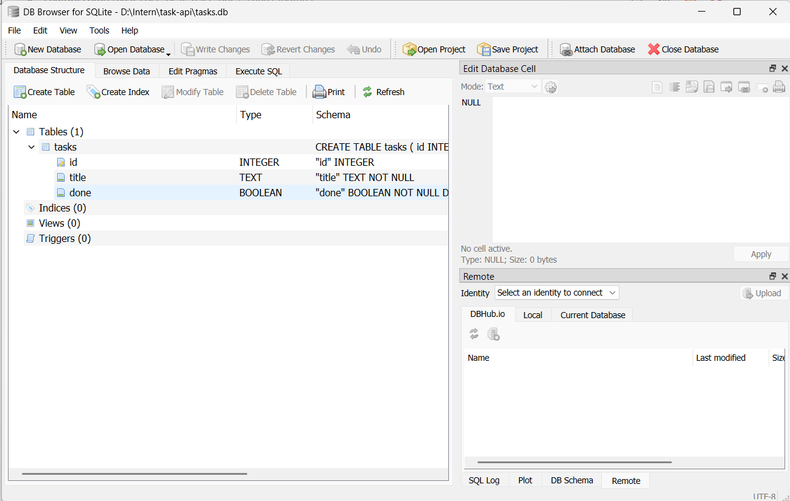

# Task API

A simple CRUD API built with FastAPI and SQLite.

## Why SQLite?

I use SQLite because it is simple, requires no separate database server,
and stores the database in a single file. The data also persists when
the API server is restarted.

## Database

The SQLite database is:

```text```
tasks.db

The database file is automatically created when the application starts.
The tasks table is also created automatically.

The database contains three seed tasks when the table is empty.

tasks.db is ignored by Git because it is a local database file.

Run the API

Activate the virtual environment:

.\.venv\Scripts\Activate.ps1

Start the FastAPI server:

uvicorn app.main:app --reload

Open Swagger UI:

http://127.0.0.1:8000/docs
API Endpoints
Method	Endpoint	Description
GET	/	Get API information
GET	/health	Check API health
GET	/tasks	Get all tasks
GET	/tasks/{task_id}	Get a task by ID
POST	/tasks	Create a task
PUT	/tasks/{task_id}	Update a task
DELETE	/tasks/{task_id}	Delete a task
SQLite Example

Example query:

SELECT * FROM tasks WHERE done = 1;

This query returns all completed tasks from the tasks table.

Database Browser

The SQLite database was explored using DB Browser for SQLite.


